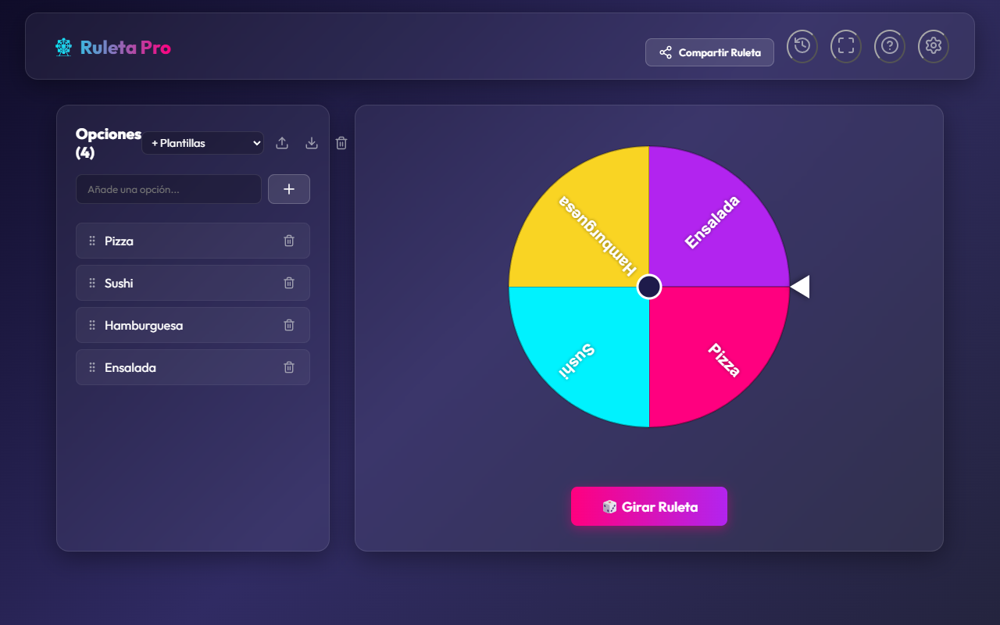
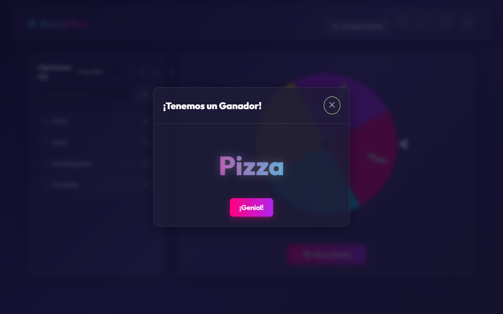
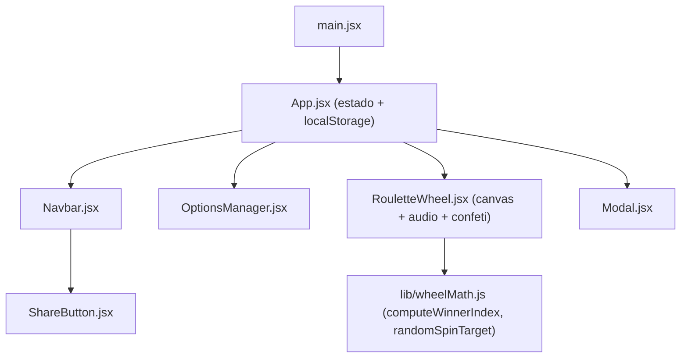

<div align="center">
  
  <h1>SuerteYa</h1>
  <p><b>Ruleta de decisiones en el navegador: escribe tus opciones, gira y deja que el azar decida.</b></p>
  
  
  
  
  
  
  <p>
    <a href="#-inicio-rápido">Inicio rápido</a> ·
    <a href="#-características">Características</a> ·
    <a href="#-arquitectura">Arquitectura</a> ·
    <a href="#-pruebas">Pruebas</a> ·
    <a href="#-lo-que-todavía-no-existe">Limitaciones</a>
  </p>
</div>

**SuerteYa** es una aplicación web de una sola página (React + Vite) que dibuja una ruleta en canvas con las opciones que tú escribas y elige una al azar. Todo corre en el navegador y se guarda en `localStorage`. **No es** una herramienta de sorteos con verificación pública ni tiene servidor, cuentas o sincronización entre dispositivos.

## 🎬 Vista rápida

<div align="center">
  
  
</div>

## ✨ Características

| Característica | Detalle |
| --- | --- |
| Ruleta en canvas | Giro animado con easing y velocidad configurable (Rápido 2 s / Normal / Lento). |
| Ganador uniforme | La elección sale de `computeWinnerIndex` (`src/lib/wheelMath.js`); un test simula 20.000 giros por caso para comprobar que no favorece segmentos. |
| Gestión de opciones | Agregar, quitar, importar `.csv`/`.txt` (una opción por línea), exportar `.csv` y plantillas predefinidas. |
| Modo Sorteo | Al cerrar el modal de ganador, esa opción se elimina de la lista. |
| Historial | Guarda los últimos 10 ganadores. |
| Compartir | Genera un enlace con la lista en el parámetro `?opts=`. |
| Temas | Neon Cyberpunk, Sunset Candy y Dark Minimalist. |
| Sonido y confeti | Sonidos con Web Audio API (sin archivos de audio), silenciables; confeti con `canvas-confetti`. |
| Persistencia | Opciones, tema, sonido, modo sorteo, velocidad e historial en `localStorage`. |
| Accesibilidad básica | Región `aria-live` para giro/resultado y `aria-label` en botones de solo icono. |

## 🏗️ Arquitectura



## 🚀 Inicio rápido

| Requisito | Versión |
| --- | --- |
| Node.js | 20 o 22 (las versiones que prueba el CI); verificado también con 24 |
| npm | el que trae Node |

1. Clona e instala:
   ```bash
   git clone https://github.com/Luiss2080/SuerteYa.git
   cd SuerteYa
   npm install
   ```
2. Arranca el servidor de desarrollo y abre la URL que imprime (Vite usa `5173` por defecto):
   ```bash
   npm run dev
   ```
3. Otros comandos:
   ```bash
   npm run build   # build de producción en dist/ (verificado)
   npm run lint    # oxlint
   ```

<details>
<summary>Estructura de carpetas</summary>

```text
src/App.jsx                       estado global, temas, historial
src/components/                   Navbar, OptionsManager, RouletteWheel, ShareButton, Modal
src/lib/wheelMath.js              matemática pura de la ruleta
.github/workflows/ci.yml          lint + test + build (Node 20.x y 22.x)
MANUAL_DE_USO.md                  guía de usuario
DOCUMENTACION_TECNICA.md          decisiones técnicas
```

</details>

## 🧪 Pruebas

```bash
npm test
```

**20 tests** en 3 archivos (Vitest + React Testing Library): `wheelMath.test.js` (selección de ganador y distribución), `OptionsManager.test.jsx` (opciones, duplicados) y `App.test.jsx`. Pasan todos en local. El CI ejecuta lint, tests y build en cada push/PR a `main`.

## 🔒 Seguridad

No hay backend ni datos sensibles. La lista compartida viaja en la URL y se decodifica con `JSON.parse` dentro de un `try/catch`; solo se acepta si es un arreglo.

## 🚧 Lo que todavía no existe

- Al compartir, una lista muy larga puede producir una URL demasiado larga; no hay acortador.
- El "azar" usa `Math.random`, no una fuente criptográfica: no sirve para sorteos con validez legal.
- Sin ganador ponderado (todas las opciones pesan igual).
- Sin pruebas end-to-end ni de accesibilidad automatizadas.
- `package.json` apunta al repositorio con su nombre antiguo (`ruleta-decisiones`).

## 📄 Licencia

MIT, ver [LICENSE](LICENSE).

<div align="center"><sub>Hecho por Luiss2080 · React, Vite y mucho azar</sub></div>
